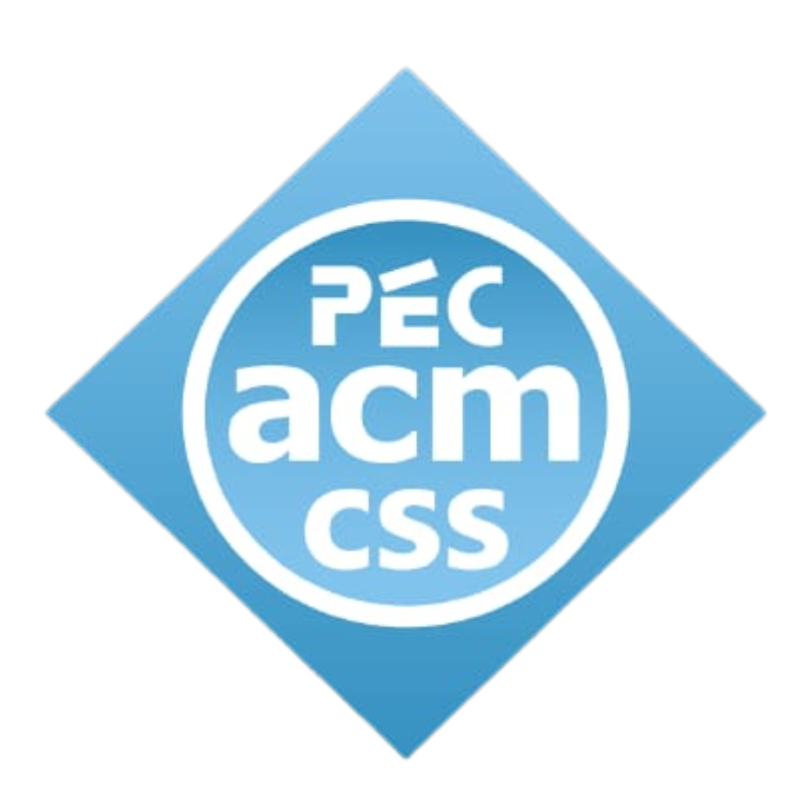

# [ACM-CSS](https://pec.acm.org/)
> The Association for Computing Machinery and Computing Classification System

We are a 200+ strong community of Computer Science enthusiasts working together to advance Computing as a Science and Profession. We are part of the official ACM Student Chapter – PEC ACM. Our base camp is at Punjab Engineering College, Chandigarh.
Our mission is to be the most impactful ACM student chapter worldwide and to enhance the coding culture of Punjab Engineering College.

## Sub-groups of PEC ACM 

- Web and App Development
- CP(Competitive Programming)
- Open Source
- Machine Learning
- Cyber Security

